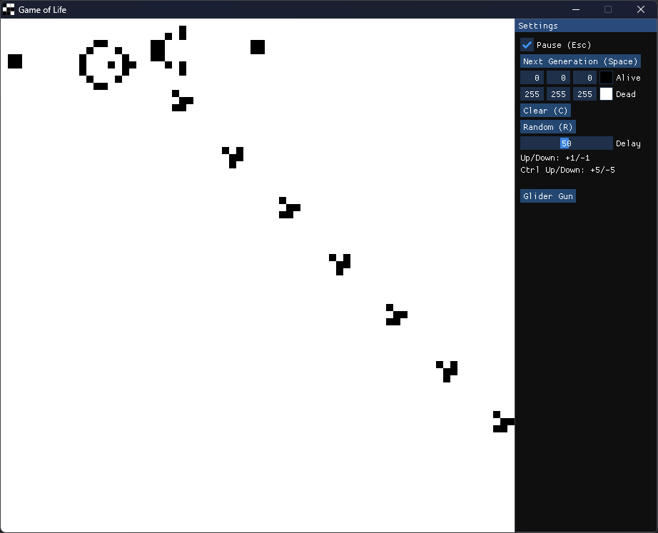

# Game of Life
John Conway's game of life made using [SDL](https://github.com/libsdl-org/SDL) and [ImGui](https://github.com/ocornut/imgui).

## Usage
### Windows
- `git clone git@github.com:Zjoswaa/life-sdl.git --recursive`
- `cd .\life-sdl\ `
- `mkdir build`
- `cmake -S . -B .\build\ -DCMAKE_BUILD_TYPE="Release"`
  -  To use Makefile on Windows use `cmake -S . -B .\build\ -DCMAKE_BUILD_TYPE="Release" -G "MinGW Makefiles" -DCMAKE_MAKE_PROGRAM:PATH=C:/MinGW/bin/make.exe`. Make sure to change the `CMAKE_MAKE_PROGRAM:PATH` to the correct path for your system.
- Open `build\Life-SDL.sln` in Visual Studio
- Change build type from `Debug` to `Release`
- Build solution
### Linux
- `git clone git@github.com:Zjoswaa/life-sdl.git --recursive`
- `cd life-sdl/`
- `mkdir build`
- `cmake -S . -B .\build\ -DCMAKE_BUILD_TYPE="Release"`
- `cd build/`
- `make`
## Showcase
